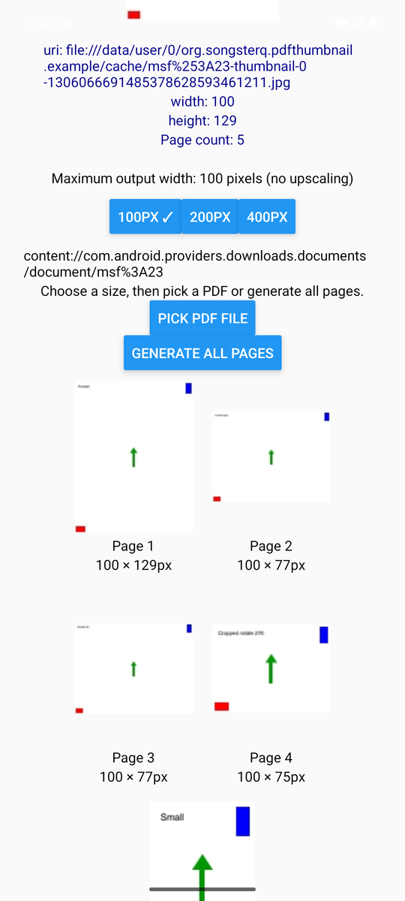
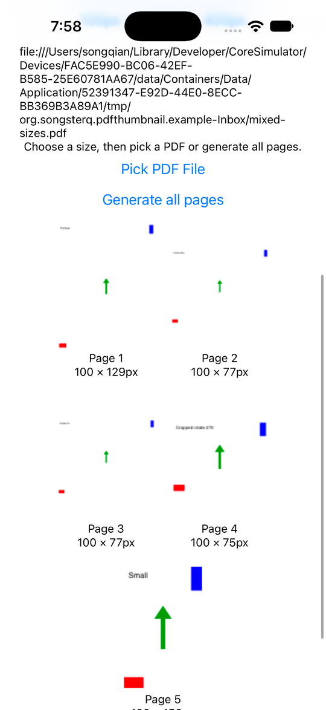

# react-native-pdf-thumbnail

Generate local JPEG thumbnails of PDF pages on iOS and Android. Uses PDFKit on
iOS and PdfRenderer on Android, with no additional runtime dependencies.

## Compatibility

| Library | React Native                  | Architecture              | iOS minimum         | Android minimum |
| ------- | ----------------------------- | ------------------------- | ------------------- | --------------- |
| 2.x     | >= 0.76                       | New Architecture required | RN's minimum (15.1) | API 24          |
| 1.x     | >= 0.60 (peer dependency `*`) | Legacy bridge / interop   | 11                  | API 21          |

CI smoke-tests RN 0.76.9 on Android and the latest RN on Android and iOS.
RN 0.76–0.78 iOS cannot build with current Xcode because of an upstream `fmt`
compilation issue. Disabling the New Architecture (possible on RN 0.76–0.81) is
unsupported and untested. Stay on [1.x](MIGRATION.md#staying-on-1x) for legacy apps.

Expo development builds work without a config plugin. CI verifies the latest
create-expo-app (SDK 57) with prebuild and release builds on both platforms.
**Expo Go is unsupported**, because it does not include this native module.
See [MIGRATION.md](MIGRATION.md) for all changes from 1.x.

## Installation

### Bare React Native

```sh
npm install react-native-pdf-thumbnail
# From your app's root, using its CocoaPods / Bundler setup:
cd ios
bundle exec pod install
cd ..
npx react-native run-ios
# Or:
npx react-native run-android
```

Enable the New Architecture in your host app and rebuild after installation.
Android builds require Java 17; the app's minSdk must be at least 24. Use the
minimum iOS deployment target required by your React Native version.

### Expo development builds

```sh
npx expo install react-native-pdf-thumbnail
npx expo prebuild
npx expo run:android
# Or, on macOS:
npx expo run:ios
```

Use a development build (local commands above or an EAS development build).
Enable the New Architecture on SDKs where it is optional. No config plugin or
library-specific permissions are needed. Rebuild the native development client
when adding the library; restarting Metro alone cannot add native code.

## Usage

```tsx
import { useEffect, useState } from 'react';
import { Image } from 'react-native';
import PdfThumbnail, { type ThumbnailResult } from 'react-native-pdf-thumbnail';

export function Preview({ filePath }: { filePath: string }) {
  const [thumbnail, setThumbnail] = useState<ThumbnailResult>();
  useEffect(() => {
    let active = true;
    setThumbnail(undefined);
    PdfThumbnail.generate(filePath, 0, { maxWidth: 200 })
      .then((result) => {
        if (active) setThumbnail(result);
      })
      .catch(console.error);
    return () => {
      active = false;
    };
  }, [filePath]);

  if (!thumbnail) return null;
  return (
    <Image
      source={{ uri: thumbnail.uri }}
      style={{ width: thumbnail.width, height: thumbnail.height }}
    />
  );
}
```

Pass a readable local PDF path or URI, such as `file:///path/to/document.pdf`.
The result dimensions are JPEG pixels; React Native styles use layout units,
so choose your display size separately when accounting for screen density.

## API reference

The default export is `PdfThumbnail`, a class with two static asynchronous methods.
The signatures below are generated from the built TypeScript declarations.

<!-- api-reference:start -->

```ts
import type {
  GenerateOptions,
  ThumbnailResult,
} from 'react-native-pdf-thumbnail';

declare class PdfThumbnail {
  static generate(
    filePath: string,
    page: number,
    options?: GenerateOptions | number
  ): Promise<ThumbnailResult>;
  static generateAllPages(
    filePath: string,
    options?: GenerateOptions | number
  ): Promise<ThumbnailResult[]>;
}
```

<!-- api-reference:end -->

`generate` renders one zero-based page. Invalid page numbers (negative,
fractional, NaN or infinite) reject with `INVALID_PAGE` in JavaScript; indexes
outside the document reject with the same code in native code.

`generateAllPages` renders every page in document order and resolves once with
the complete array. It has no progress callback, page-range option or cancellation
API. If a page fails, the promise rejects; earlier output files may remain.

### `GenerateOptions`

| Property    | Type     | Default   | Meaning                                                                                                        |
| ----------- | -------- | --------- | -------------------------------------------------------------------------------------------------------------- |
| `quality`   | `number` | `80`      | JPEG quality clamped to 0–100, then truncated to its integer part by the native encoder. Infinities clamp too. |
| `maxWidth`  | `number` | Unlimited | Positive finite maximum output width in pixels.                                                                |
| `maxHeight` | `number` | Unlimited | Positive finite maximum output height in pixels.                                                               |

Both methods also accept a bare quality number for compatibility with 1.x.
Omitting options is equivalent to `{ quality: 80 }`. A container other than a
number or a non-null, non-array object, a non-number/NaN quality, or a zero,
negative, non-number or non-finite size limit rejects with JavaScript `TypeError`,
without a PDF error code. All failures, including validation failures, are
promise rejections: handle them with `await` inside `try`/`catch`.

```ts
import PdfThumbnail, { type GenerateOptions } from 'react-native-pdf-thumbnail';

declare const filePath: string;
const options: GenerateOptions = { quality: 85, maxWidth: 200, maxHeight: 200 };
await PdfThumbnail.generate(filePath, 0, options);
await PdfThumbnail.generate(filePath, 0); // Default quality 80, no size limit.
await PdfThumbnail.generate(filePath, 0, 95); // Legacy quality argument.
await PdfThumbnail.generateAllPages(filePath, 90);
```

### `ThumbnailResult`

| Property | Type     | Meaning                                                               |
| -------- | -------- | --------------------------------------------------------------------- |
| `uri`    | `string` | Plain `file://` URI of a generated JPEG in the app's cache directory. |
| `width`  | `number` | Actual JPEG width in pixels, independent of screen density.           |
| `height` | `number` | Actual JPEG height in pixels, independent of screen density.          |

Each call writes new files; the library has no thumbnail lookup cache. The OS
may evict cache files. Retention, reuse, invalidation and cleanup belong to the app.

### Accepted inputs

| Input                                                                   | iOS | Android |
| ----------------------------------------------------------------------- | --- | ------- |
| Absolute filesystem path, e.g. `/path/to/document.pdf`                  | Yes | Yes     |
| Local `file://` URI with an absolute path and empty host or `localhost` | Yes | Yes     |
| Readable `content://` URI from a document provider                      | No  | Yes     |
| Remote `http://` / `https://`, `ph://`, relative or empty path          | No  | No      |

Unsupported forms reject with `UNSUPPORTED_URI`. Download remote PDFs in your
app, then pass their local path. Android provider access must still be granted
and the provider must expose a descriptor usable by PdfRenderer; copy to app
storage when necessary. Copy iOS picker results into app storage while access
is available (see the picker recipe).

### Sizing, crop box and rotation

Both platforms render the crop box (the visible page area), falling back to the
media box when absent, and apply intrinsic `/Rotate`. A 612×792-point page rotated
90° or 270° displays at 792×612. The background is white.

Let `w` and `h` be the displayed, rotated crop-box dimensions in PDF points:

```text
scale = min(1, maxWidth / w, maxHeight / h)  // Ignore omitted limits.
width  = max(1, round(w * scale))
height = max(1, round(h * scale))
```

Positive halves round up, as in `Math.round`. There is no upscaling and no default
size cap; without limits, the scale is one pixel per PDF point. Both platforms
render directly into the target bitmap. Use limits for large PDFs to bound
bitmap memory; limits below one pixel still produce at least one pixel.

These examples come from [fixtures/expectations.json](fixtures/expectations.json):

| Page / options                               | JPEG pixels |
| -------------------------------------------- | ----------- |
| Normal page, no limits                       | 612×792     |
| Normal page, `maxWidth: 200`                 | 200×259     |
| Normal page, `maxWidth: 200, maxHeight: 100` | 77×100      |
| Normal page, `maxWidth: 2000`                | 612×792     |
| Cropped page                                 | 300×400     |
| Page rotated 90° / 270°                      | 792×612     |
| Huge page, `maxWidth: 1024`                  | 1024×1024   |

### Errors: `PdfThumbnailErrorCodes` and `PdfThumbnailErrorCode`

`PdfThumbnailErrorCodes` is a frozen object with these named string constants.
`PdfThumbnailErrorCode` is the union of its values. PDF failures include `code`
and a human-readable `message` naming the file and page where relevant.

The first five codes below are exercised by the rejection cases in
[fixtures/expectations.json](fixtures/expectations.json). The final two describe
allocation and unexpected failures, which the deterministic fixtures do not force.

| Code                 | When                                                                                          |
| -------------------- | --------------------------------------------------------------------------------------------- |
| `UNSUPPORTED_URI`    | Unsupported input scheme or path form; iOS also rejects `content://`.                         |
| `FILE_NOT_FOUND`     | Input does not exist or cannot be opened for reading, including permission failures.          |
| `INVALID_FILE`       | Input is readable but not a readable PDF, or has no readable pages / invalid page dimensions. |
| `PASSWORD_PROTECTED` | A user password is required. Android also uses this for unsupported PDF security.             |
| `INVALID_PAGE`       | Page is not an integer >= 0, or is outside the document's page range.                         |
| `OUT_OF_MEMORY`      | Android cannot allocate rendering memory. iOS allocation failure cannot reliably be caught.   |
| `INTERNAL_ERROR`     | JPEG creation/writing or another unexpected failure.                                          |

Owner-only encrypted PDFs (empty user password) render normally. There is no
password parameter to unlock a locked PDF. `TypeError` for invalid options and
the linking error are separate from these PDF error codes.

```ts
import PdfThumbnail, {
  PdfThumbnailErrorCodes,
  type PdfThumbnailErrorCode,
} from 'react-native-pdf-thumbnail';

declare const filePath: string;
try {
  await PdfThumbnail.generate(filePath, 0, { maxWidth: 200 });
} catch (error: unknown) {
  if (error instanceof TypeError) {
    console.log(error.message);
  } else if (typeof error === 'object' && error !== null && 'code' in error) {
    const code = error.code as PdfThumbnailErrorCode;
    if (code === PdfThumbnailErrorCodes.PASSWORD_PROTECTED) {
      console.log('This PDF requires a user password.');
    }
  }
}
```

## Recipes

### Thumbnails for a list

Render only visible items in a long list; keep concurrency small. `maxWidth`
reduces rendering memory and the size of each JPEG.

```ts
import PdfThumbnail, { type ThumbnailResult } from 'react-native-pdf-thumbnail';

export async function listThumbnails(paths: readonly string[]) {
  const thumbnails: ThumbnailResult[] = [];
  for (const path of paths) {
    thumbnails.push(await PdfThumbnail.generate(path, 0, { maxWidth: 160 }));
  }
  return thumbnails;
}
```

### All pages and progress

```ts
import PdfThumbnail from 'react-native-pdf-thumbnail';

declare const filePath: string;
const pages = await PdfThumbnail.generateAllPages(filePath, { maxWidth: 200 });
console.log(`Generated ${pages.length} pages`);
```

For long documents, use `generate` sequentially when your app already knows the
page count from another source. Publish progress after each page and yield
between batches so the UI can update. The library does not expose page count
separately. Avoid launching a promise for every page at once.

```ts
import PdfThumbnail, { type ThumbnailResult } from 'react-native-pdf-thumbnail';

export async function renderWithProgress(
  path: string,
  pageCount: number,
  onProgress: (done: number, total: number) => void
): Promise<ThumbnailResult[]> {
  const results: ThumbnailResult[] = [];
  for (let page = 0; page < pageCount; page++) {
    results.push(await PdfThumbnail.generate(path, page, { maxWidth: 200 }));
    onProgress(page + 1, pageCount);
    if ((page + 1) % 8 === 0) {
      await new Promise<void>((resolve) => setTimeout(resolve, 0));
    }
  }
  return results;
}
```

### Cache by path + page + options

This in-memory recipe reuses results and concurrent requests. It needs
`@dr.pogodin/react-native-fs` in your app to check whether the OS evicted a JPEG.
A persistent cache also needs a stored index and source modification/version
information. Invalidate the entry when the source changes at the same path;
provider permissions and URI lifetimes remain the app's responsibility.

```ts
import { exists } from '@dr.pogodin/react-native-fs';
import PdfThumbnail, {
  type GenerateOptions,
  type ThumbnailResult,
} from 'react-native-pdf-thumbnail';

const cache = new Map<string, Promise<ThumbnailResult>>();

export async function cachedThumbnail(
  path: string,
  page: number,
  options: GenerateOptions = {}
): Promise<ThumbnailResult> {
  const key = JSON.stringify([
    path,
    page,
    String(options.quality ?? 80),
    options.maxWidth === undefined ? null : String(options.maxWidth),
    options.maxHeight === undefined ? null : String(options.maxHeight),
  ]);
  const existing = cache.get(key);
  if (existing) {
    const result = await existing;
    if (await exists(decodeURIComponent(result.uri.slice('file://'.length)))) {
      return result;
    }
    cache.delete(key);
  }
  const pending = PdfThumbnail.generate(path, page, options);
  cache.set(key, pending);
  try {
    return await pending;
  } catch (error) {
    if (cache.get(key) === pending) cache.delete(key);
    throw error;
  }
}
```

### Clean up generated files

Install `@dr.pogodin/react-native-fs` in the app for this recipe and rebuild its
native binaries. Track the results you own, release them from the UI / cache
index, then delete their files. Do not erase the app's entire cache directory:
it may contain unrelated data. Track leftovers from failed all-pages operations
in your own maintenance policy too.

```ts
import { exists, unlink } from '@dr.pogodin/react-native-fs';
import { type ThumbnailResult } from 'react-native-pdf-thumbnail';

export async function removeThumbnails(results: readonly ThumbnailResult[]) {
  for (const result of results) {
    const path = decodeURIComponent(result.uri.slice('file://'.length));
    if (await exists(path)) await unlink(path);
  }
}
```

### Pick a PDF with `@react-native-documents/picker`

Install the picker in your app and rebuild (including pods on iOS). Choose a
picker version compatible with your RN version: the example's picker 12 requires
RN >= 0.79. This recipe makes an app-local copy on either platform, avoiding
provider lifetime issues. Direct `content://` access also works on Android while
the grant remains valid.

```ts
import {
  errorCodes,
  isErrorWithCode,
  keepLocalCopy,
  pick,
  types,
} from '@react-native-documents/picker';
import PdfThumbnail from 'react-native-pdf-thumbnail';

export async function pickThumbnail() {
  try {
    const [document] = await pick({ type: [types.pdf] });
    const [copy] = await keepLocalCopy({
      files: [{ uri: document.uri, fileName: document.name ?? 'document.pdf' }],
      destination: 'cachesDirectory',
    });
    if (copy.status !== 'success') throw new Error(copy.copyError);
    return await PdfThumbnail.generate(copy.localUri, 0, { maxWidth: 200 });
  } catch (error) {
    if (
      isErrorWithCode(error) &&
      error.code === errorCodes.OPERATION_CANCELED
    ) {
      return undefined;
    }
    throw error;
  }
}
```

Clean up the copied source PDF too when it is no longer needed. To retain it
across sessions, copy into documents storage and manage its lifecycle explicitly.

## Troubleshooting

### The module is not linked

Calls reject with this text (the `pod install` line appears on iOS only):

```text
The package 'react-native-pdf-thumbnail' doesn't seem to be linked. Make sure:

- You have run 'pod install'
- You are using React Native >= 0.76 with the New Architecture enabled
- You rebuilt the app after installing the package
- You are not using Expo Go
```

Check the compatibility table, enable the New Architecture, install iOS pods,
and rebuild the native app / Expo development client. A Metro reload alone
cannot fix missing native registration.

### Android autolinking cache

After upgrading or changing codegen configuration, delete
`android/build/generated/autolinking` in the consuming app and rebuild. The RN
Gradle plugin can retain stale autolinking data because its cache tracks the
app's `package.json`, not library-side codegen changes. In this repo the path is
`example/android/build/generated/autolinking`. Confirm your app's minSdk is 24+
and Java 17 is selected.

### iOS pods and Xcode

Run `bundle exec pod install` in your app's `ios/` directory after installing or
upgrading, then rebuild the `.xcworkspace`. Ensure the deployment target follows
RN's minimum and the New Architecture is enabled. On RN 0.76–0.78 with current
Xcode, resolve the upstream `fmt` issue or upgrade RN; reinstalling this package
does not fix that compiler error.

### Missing files or large documents

For `FILE_NOT_FOUND`, check that the source still exists and a provider grant is
active; copy to app-local storage if necessary. For memory pressure, set
`maxWidth` / `maxHeight` and render visible pages sequentially. Cache thumbnails
only while their backing JPEG files exist.

## Demo

The example lets you pick a PDF, choose a maximum width, generate a first-page
preview or an all-pages grid, and run the fixture self-test.

| Android                                                             | iOS                                                         |
| ------------------------------------------------------------------- | ----------------------------------------------------------- |
|  |  |

See [CONTRIBUTING.md](CONTRIBUTING.md) for setup, native builds, tests and releases.

## License

[MIT](LICENSE)
